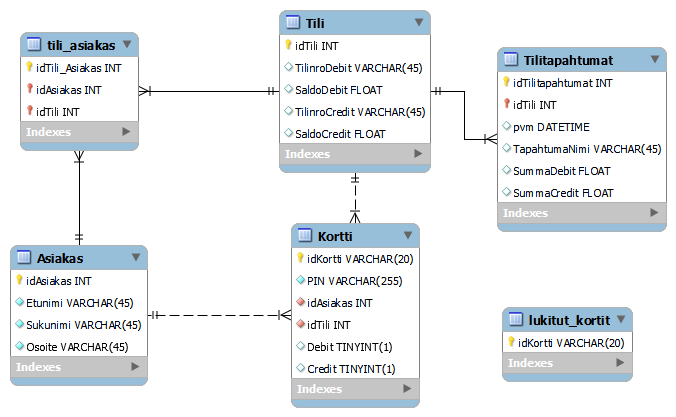

# ATM simulator
This is a project I and four of my fellow students made for a course in Fall 2023.
---
## Project description
This project uses an electronic card reader, and multiple cards with different IDs coded in them. 

## Project structure
-**DLLPinCode** - DLL for verifying pincodes
-**DLLRestApi** - DLL for making REST -commands through backend to database
-**DLLSerialPort** - DLL for identifying and verifying card reader (This demo has a virtual card for demonstration)

-**frontend** - All graphical user interface elements

-**backend** - For interfacing with the database. Made using Node.js

**pankkidb_v2_blacklist.sql** - Dump file for the database. Needs to be hosted, and .env file must be created to use. .env file must include SQL_SERVER, PORT, and MY_TOKEN constants

-**other .sql files** - procedures for manipulating the database

## ER-diagrammi

